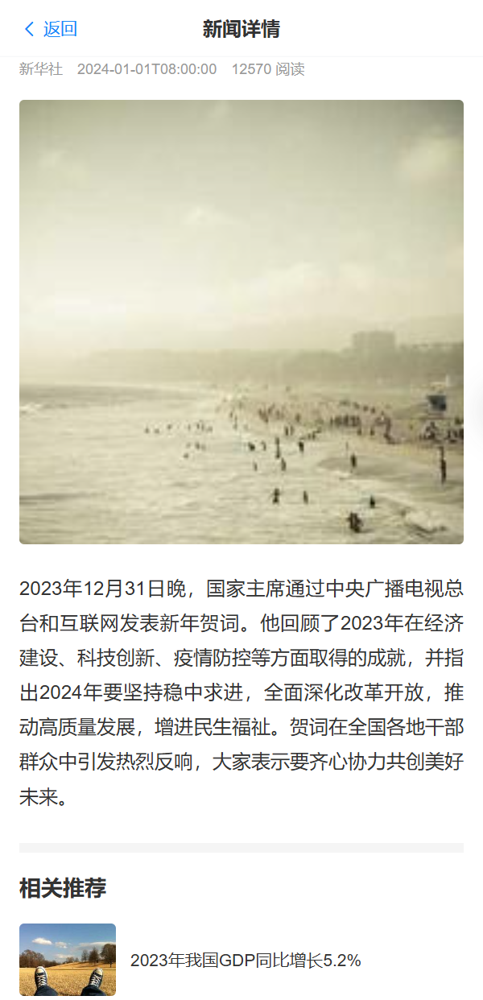
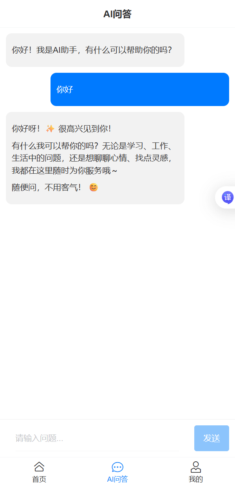
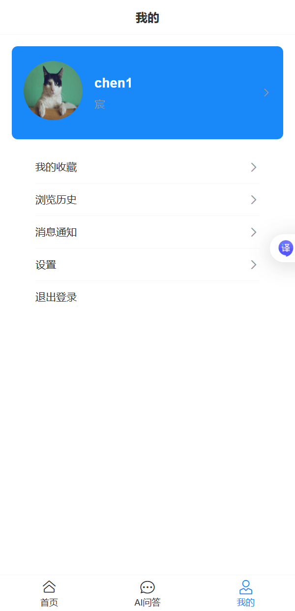

# 头条Web应用

一个基于 FastAPI 的新闻聚合平台后端，集成 AI 问答功能。

## 技术栈
- Python + FastAPI
- SQLite / MySQL
- Redis 缓存
- JWT 用户认证
- 通义千问大模型 API

## 功能模块
- 用户注册登录（JWT Token）
- 新闻列表、分类浏览、详情页
- 新闻收藏、浏览历史
- AI 智能问答（基于新闻内容）

## 如何运行
1. 克隆仓库
   ```bash
   git clone https://github.com/chen123360/news-aggregator.git
   cd news-aggregator

## 项目截图

### 首页


### 新闻详情页


### AI问答界面


### 我的
